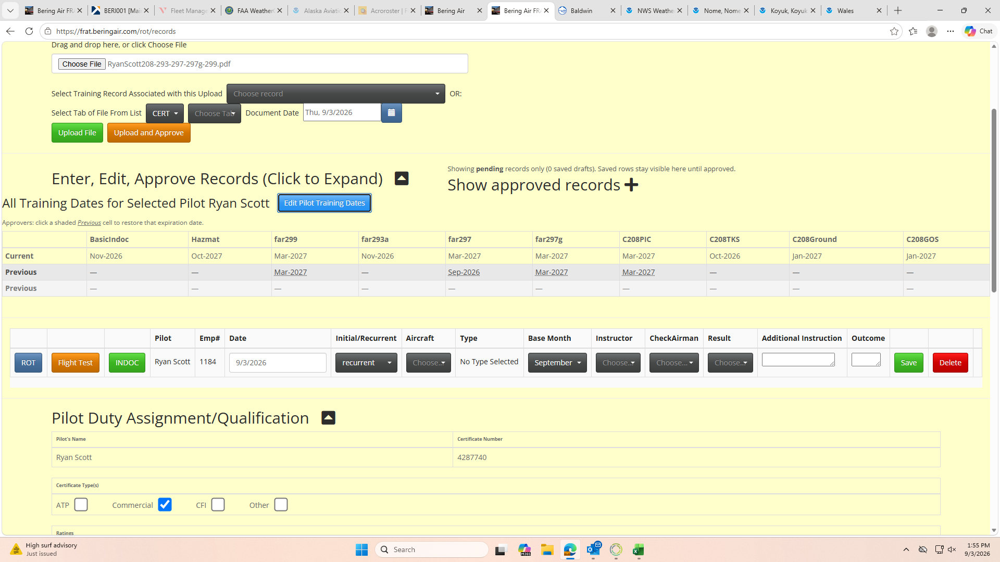
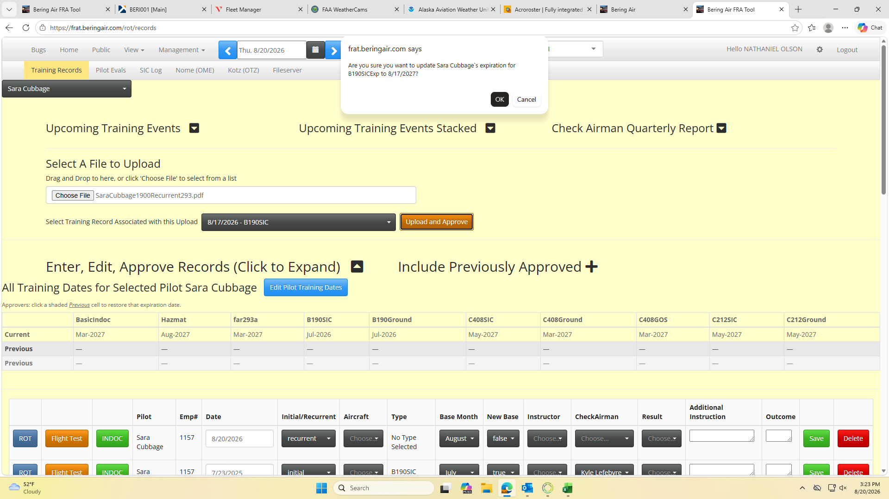
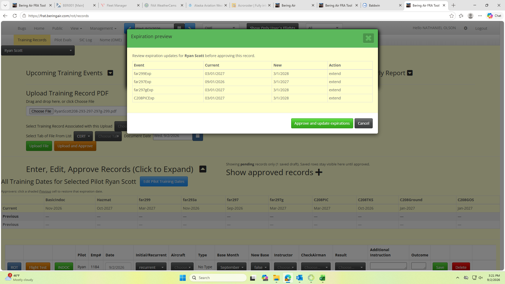
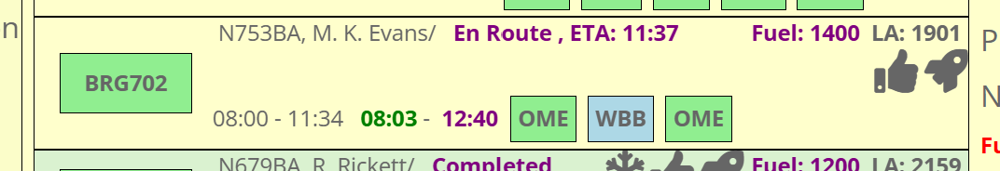
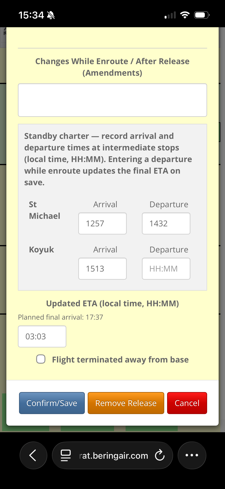
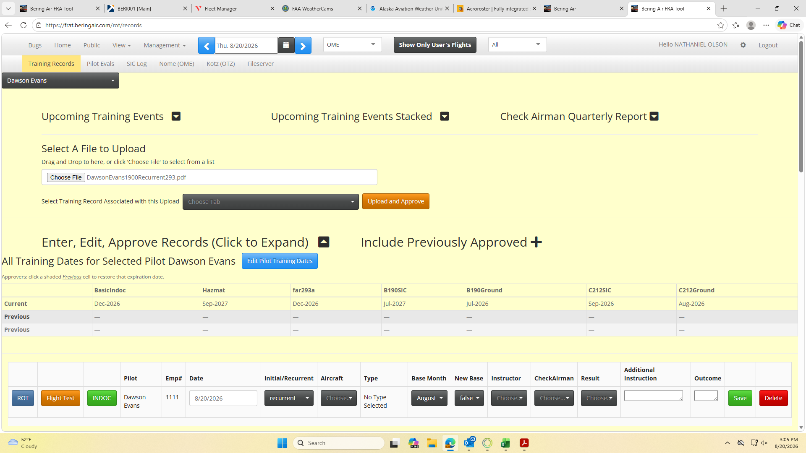
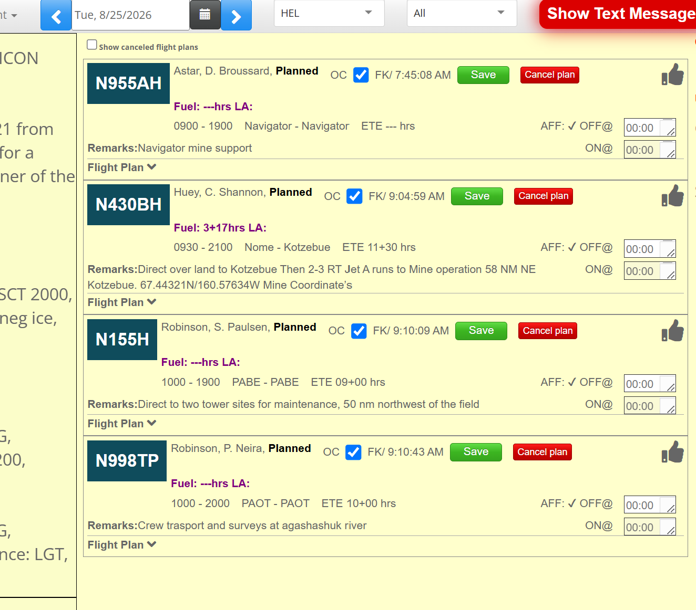
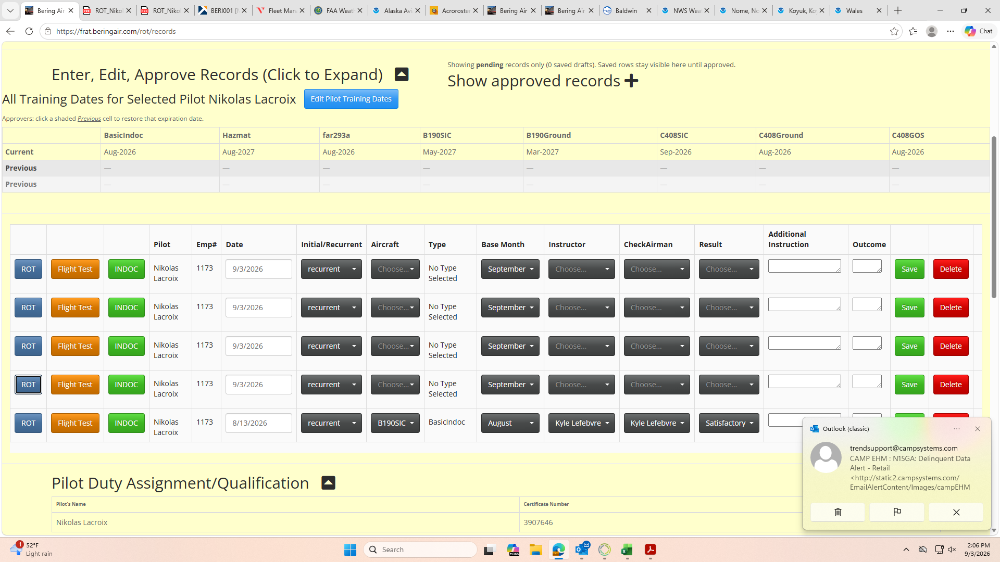
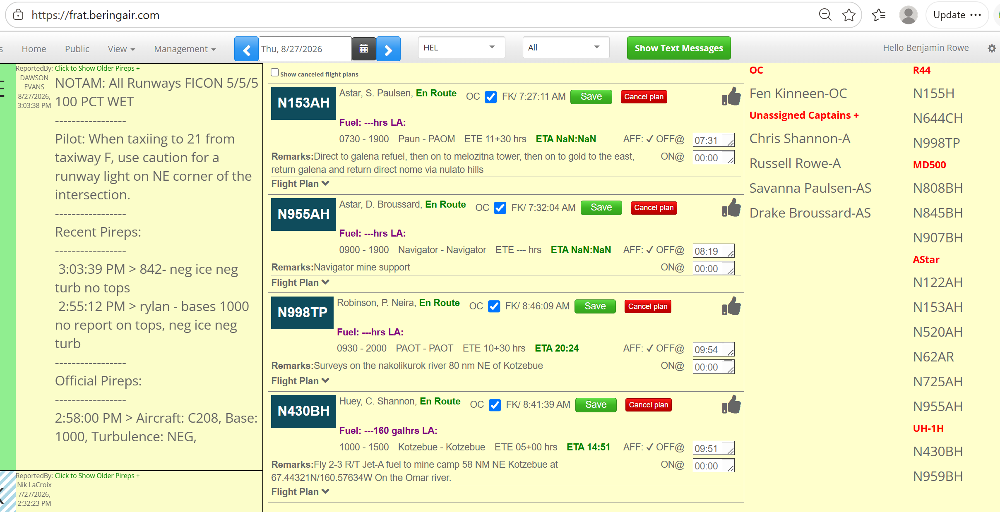

# FRA team backlog (issues)

_Generated from fraBering `/api/issues`. Regenerate: `node scripts/export-team-backlog/index.js`._

## Active (developer approved — build queue)

_Developer-approved, open or in progress. Agents should implement these._

## #31 Flashing Weather Idea

- **Type:** feature · medium · open
- **Reporter:** Fen Kinneen

**Original report:**

Hi Andy,

 

Today we are holding 840 on SMK weather. WBB looks almost okay, but definitely not to a point where I’m ready to call if VFR. In order to stop the flashing, I just marked the ceiling as 300. I know it’s not 300, but I just wanted to make the flashing stop, as we should. I’m thinking a third check box in the manual observation page could say “not VFR” or something of the like. Something that says “I don’t know what the weather is, but it’s not good enough to dispatch for VFR flight” in just a word or two. Turns the box red, prevents dispatch, stops the flashing. Bada-bing, bada-boom.

## #23 Trying to rebase when not told to do so

- **Type:** bug · medium · in_progress
- **Reporter:** NATHANIEL OLSON

**Original report:**

Uploading and approving is trying to rebase regardless of being told not to.

**Progress (changed, not resolved):**

NATHANIEL OLSON: Much better.  However, if you look at the above screen shot.  It has the previous dates and the current dates as the same for the ones that I updated.  Not sure if that is just a glitch based on the previous glitch.  Overall, the popup with the selectable rebase is exquisite.  Nice work Andy.

**Latest screenshot:**

**Comments:**
- NATHANIEL OLSON: Looking at it now, I hit save when I built the ROT and it appears it didn't save, but if you look at the training record I was trying to attach it to, it was dated 8/17/26.  Looks like I hit "save" and it disappears but still available to associate with for upload.
- Andy Smircich: -make sure we read the follow up comment and the screenshot to understand the full context
- rebase option is tricky since there are often multiple base months in one training record processing.  We need to make sure we are doing this properly, it might take a re-think of the approach a little bit
- Andy Smircich: Shipped in dev — ready for your review.

Upload and Approve was rebasing expiration even when New Base was false. It calculated from the training record date instead of extending the pilot’s current expiration.

Fix:
• New Base = false → extend current exp by the training interval (e.g. Aug 2027 → Aug 2028). Training date is only used when there is no prior exp.
• New Base = true → rebase from base month / training date (same as before, with confirm if you’re within the normal window).

Removed the misleading “set a new base month?” prompt that could rebase even when New Base was false.

Please retry your Sara Cubbage / 8/17 B190SIC upload with New Base false and confirm the exp confirm shows an extension from current Aug 2027, not 8/17/2027.
- NATHANIEL OLSON: I'll give it a shot but to build off of your "it might take a rethink of the approach."  I agree.  This approach works well for hard copies and binders, but doesn't translate well to the current training records program.  It is almost more work than paper and seems far less efficient.  If you could guide AI to build a completely new, streamlined approach or system, I'd definitely be open to options.  Maybe that is asking too much, but at this point, the current method with paper and binders seems preferable.
- Andy Smircich: Lets work on this
- Andy Smircich: Thanks for the honest feedback — that's exactly what we need to hear.

You're right that the current Records flow was ported from a binder-era mental model: one line per checkride, manual base month, split upload vs approve UIs, confirm dialogs per event. The rebase fix addresses one bad behavior, but it doesn't fix the underlying friction you're describing. I'm open to a real redesign if we can define what "streamlined" means for your day-to-day work.

Before we sketch a replacement, I need your input on a few things. Reply here with as much or as little detail as you want — bullet answers are fine.

**1. Routine recurrent — happy path**
What's the minimum you'd want? (e.g. select pilot → mark events done → attach PDF → one click done.) Which steps today feel like pure overhead?

**2. Roles**
Should Kaleb-only upload + you/Fen approving in a separate step stay? Or does one person usually do the whole thing? Anyone else who needs write access beyond the current list?

**3. New Base**
When should expiration rebase from the training month vs simply extend the pilot's current expiration by 12/6 months? Should that be **per training event** on the same checkride, not one flag for the whole record?

**4. One checkride, multiple events**
How often does one ride cover B190 PIC + ground + 299 together? Should approving update all of them in one action?

**5. Paper vs digital**
Which paper artifacts are still required (ROT PDF forms, quarterly check-airman report, physical binder copy)? What could we drop or auto-generate?

**6. Approve without re-upload**
Do you ever need to approve a record whose PDF was already uploaded separately? Should there be a plain **Approve** button on saved rows (not only Upload and Approve)?

**7. Pilot boards vs Records**
Should OME/OTZ boards and Records be one combined view, or stay separate with synced expiration dates only?

**8. Audit / history**
Is Current + 2 Previous expiration history enough for your audit needs, or do you need a full who/when/why change log per event?

---

**Meanwhile — please retry the Sara Cubbage / 8/17 B190SIC case** with **New Base = false** and confirm whether the exp prompt now shows an extension from the current Jul 2027 expiration (not 8/17/2027). That tells us whether the immediate bug is fixed while we scope the bigger redesign.

On the "save and it disappears" note: unapproved saved records are hidden unless **Include Previously Approved** is toggled — that's confusing and is on the fix list either way.
- NATHANIEL OLSON: 1) Select pilot, select aircraft, select evaluation(s) (293,297,297g,299) (293 tied to specific aircraft, all others apply to pilot as a whole), modifiable test form generated with default events checked and all admin info (pilot data, expiration dates, base months), check pilot can then customize if necessary, save/print, form signed and hardcopy submitted to flight department headquarters, headquarters reviews/uploads/approves.  At this point all expiration dates and base months are automatically updated on the pilot board.

2)Check Pilots build paperwork, print, sign, turn into headquarters.  Fen/Me upload and approve for the time being and will add others as we get the flow figured out. 

3)Rebase should not occur when evaluation is performed in any due month (early/due/late).  Rebase should automatically occur anytime evaluation is outside of that.  Due month is the month and year when the checkride expires.  So if expiration date is 8/27 and a checkride is done 9/26 that would be a rebase.  Obviously 8/27 due month 9/27 checkride date would not be a rebase. 

4)Ground and flight training/Evals should never be on the same paperwork.  Ground training produces a ROT only.  Flight training produces a ROT only.  Evaluations should produce flight test forms only. 

5)Unfortunately, I think all artifacts will be required at this point.  Even if we get the electronic flight records opspec signed (should be easy), the electronic signatures section will be more difficult due to authentication requirements.  That will take additional effort and potentially money so for the time being, all current forms must be generated.  

6)This is interesting.  If the program is auto populating all base months and expiration dates, it seems like this would not be necessary.  However, it is probably prudent to have the option to "reapprove" something without uploading in order to modify a date or correct an entry error not related to the paperwork data.

7) Nome and OTZ could be combined into one view, however, still organized Nome PIC/FO/OTZ PIC.  All on one view would be nice.  We will see what the unintended consequences of this are.   

8)There does need to be a way to audit the whole system and audit an individuals Bering pilot history.  It's required to keep initial training documents permanently, so if we are going to go full electronic, lets have a pilots entire Bering history.  That way, if we make a mistake, the "audit" can retrace the training steps all the way back to the genesis of their career at Bering.  This would also provide redundancy, so that if an automated audit as somehow allowed something to slip through the cracks, then a human could go back and manually audit.  

Hope this helps.  Thanks for the effort.  Nice work Andy.
- Andy Smircich: <paste draft from doc section "Draft reply to Nate">
- Andy Smircich: Sorry — the previous comment was a mistaken placeholder from our posting script, not the real reply. Here is the intended message:

Nate — thanks again for the straight talk. We're treating this as product direction, not just a one-off bug.

**Plan (two phases):**

**Phase 1 — quick wins (next deploys)**  
- Pending/draft queue so saved rows don't "disappear" (no more hunting **Include Previously Approved**).  
- **Approve** on a saved row when the PDF is already on file (not only Upload and Approve).  
- One shared upload flow for Kaleb and approvers (same screen, role gates the buttons).  
- **Single expiration preview** before approve: every event on the row shows current → new (extend vs rebase per event, not one New Base flag for the whole row).

**Phase 2 — "training session" (bigger redesign)**  
- One **checkride session** per ride: pilot, date, instructor, check airman, events completed, PDF attached once, then **one approve** updates all relevant expirations.  
- Kaleb can save a **draft** and submit; you/Fen **approve** when ready.  
- We'll build this **above** the legacy table first so you can compare without losing today's workflow until you sign off.

**Not in scope for now:** merging OME/OTZ pilot boards into Records (we can revisit after Phase 2 soaks).

Your answers to the numbered questions still help — bullet replies are fine. Even partial answers on **routine recurrent (1)**, **roles (2)**, and **multi-event rides (4)** are enough to start Phase 2 mockups.

When you have a minute, please still retry the **Sara Cubbage / 8/17 B190SIC** case with **New Base = false** so we know the immediate rebase fix is good on your end.
- Andy Smircich: Phase 1 Records improvements are in this deploy — ready for you to try on `/rot/records`.

**What changed**
1. **Pending queue** — default table view shows pending/draft rows only. Saved records stay visible until approved (no more hunting “Include Previously Approved”). Toggle is now **Show approved records**.
2. **Approve without re-upload** — on a saved row with a PDF already linked, approvers get an **Approve** button (no need to pick the file again).
3. **Expiration preview** — one modal before approve/re-approve lists every training event: current exp → new exp → extend/rebase/initial. One confirm updates all.
4. **Unified upload** — one upload section for Kaleb and approvers; same associate-record picker. **Upload File** vs **Upload and Approve** depends on role.

**Please verify**
- Save a draft → still visible in pending list
- Kaleb uploads PDF → you **Approve** from the row (preview modal → confirm)
- Multi-event row shows all exp lines in one preview

Your bullet answers on routine path (1), roles (2), and multi-event rides (4) still help for Phase 2 session UI — no rush.

Also when you can: retry **Sara Cubbage / 8/17 B190SIC** with **New Base = false** so we know the original rebase fix is good.
- NATHANIEL OLSON: Just tried to upload and approve Ryan Scott's checkride from yesterday.  The new look of the expiration date update notice is far far superior.  Nice work Andy.  Looks like there is a coding glitch through (see above screen shot, accidentally loaded it twice).  Now that I see that popup for confirming the updated expiration date, how about you make that part editable.  So you don't even ask about "new base" when building the training event.  When you hit submit the pop up comes up with columns "event" "current expiration" "New base" (the new base column is a check box so select for new base) then "new expiration" (date would change instantly based on checking or unchecking new base box).  Action column could be removed.  How does that sound?  Really, would like the logic to be built in to where when the flight test form is built, the check pilot or instructor selects, pilot-aircraft-evaluation(s)/training and hits generate, then the program generates the form with prepopulated but modifiable expiration/base month.  Then when I upload and approve I get the popup with current and new expiration.  Thats where I do the final QC then approve.  That would be an excellent flow.  The current popup format is excellent and much easier to interpret.  Nice work Andy.
- Andy Smircich: Shipped the next slice on the expiration preview popup (still in progress on #23):

**Editable preview modal**
- Columns: Event | Current expiration | **New base** (checkbox) | **New expiration** (editable date)
- Checking/unchecking **New base** recalculates the proposed date immediately
- Removed the separate Action column

**New base on the training row**
- Hidden on the record row — rebase vs extend is decided in the approve popup instead

**Auto rebase logic**
- Default checkbox follows grace-month rules: early/due/late month relative to current expiration → extend; outside that window → rebase

**Duplicate popup / rows**
- Guard so approve cannot open the preview twice at once
- Dedupe events in the preview table when the same expiration key would appear twice

Please retry Ryan Scott’s checkride approve flow and let me know if the popup looks right and the dates behave as expected. Longer-term “generate flight test form with prepopulated exp/base” is still on the Tier B list.
- NATHANIEL OLSON: Much better.  However, if you look at the above screen shot.  It has the previous dates and the current dates as the same for the ones that I updated.  Not sure if that is just a glitch based on the previous glitch.  Overall, the popup with the selectable rebase is exquisite.  Nice work Andy.

**Attachments:**
- 
- 
- 
- 

## Ready for review (shipped — reporter verify, do not build)

_Waiting for reporter sign-off in the app._

## #28 Blank flight origin

- **Type:** bug · high · ready_for_review
- **Reporter:** Benjamin Rowe
- **Status:** ready for review

**Original report:**

Why is the origin of flight 704/31Aug26 blank?  The flight is showing up on the OTZ flight board.  Either station is fine, but a Kawerak charter from Nome is probably Nome origin.  And the origin station needs to be populated. Thanks. Can’t attach screenshot from phone.

**Comments:**
- Andy Smircich: Investigate this
- Andy Smircich: Shipped — ready for your review.

**#28 Blank flight origin (BRG704 / 31Aug26)**

Takeflite sometimes sends airport **code** only (e.g. PAOM) without **name** on manifest legs. The sync only used `leg.origin.name`, so `airports[0]` could be blank and the first routing chip on the status board showed nothing.

**Fix**
• Route building now resolves airports from Takeflite **name or code** (code matched to master airport list → e.g. Nome / OME).
• If the crew-less-first-leg filter leaves a blank origin, the true departure airport from the original first leg is restored.
• One bad airport in the route no longer aborts processing for the rest of the flight.
• Flight Release **Origin** falls back to routing when the iPad PFR has no `flightOrigin`.

Please verify on OTZ (or Nome) status board: BRG704 or the next Kawerak charter from Nome should show **OME** (or the correct origin) on the first airport chip after the next sync (~1 min post-deploy).

## #25 Overdue aircraft time pop ups

- **Type:** bug · high · ready_for_review
- **Reporter:** AGNAQIN SCHAEFFER
- **Status:** ready for review

**Original report:**

Is there a way to pull flight off times from takeflight in order to reduce excess amounts of overdue aircraft time pop ups?

**Comments:**
- NATHANIEL OLSON: To add on to this, when building charters in AndyNet, could you build a block for "standby time" for each village that defaults to 0 but obviously could be modified for estimated standby time for both Flight Release tracking and quoting purposes?  So, Flight Release currently needs to pull dispatcher input off times from takeflight and in the future needs to mirror that in AndyNet.  Also, I recommend that you get Lynn and Star setup with AndyNet accounts so that they can get up-to-speed on AndyNet and provide you the creator with valuable input from OTZ.  Nice work Andy.
- Andy Smircich: -Look into if the popups are necessaray as often as they come in (Maybe too much)
-Is it obvious what to do to prevent repeated popups same message?
-THey definitely have accounts 
- Times requested should only be intermediate times, which are normally not recorded in takeflite.  Make this clear, and if that's not what the popups are asking for, fix it
- Andy Smircich: Shipped in dev — ready for your review.

Addresses overdue standby-charter time popups (#25):

• Takeflite OFF/land times now import into intermediate village arrival/departure fields when available (each tf() sync, ~1 min). Manual dispatcher entries are never overwritten.
• Popups only for **enroute** standby charters missing intermediate times **45+ min** past estimate — not origin/final.
• Modal copy clarifies: intermediate villages only; Takeflite fills OFF when logged there.
• **Dismiss for today** hides that specific stop (not the whole flight). Max 2 reminders per flight per session; 15 min cooldown.
• Standby charter detection is now **ground-time only** (45+ min scheduled on the ground at a village) — multi-leg and long-block rules removed (see #13).

Please verify as dispatch: on a live standby charter with Takeflite OFF logged at a village, confirm Flight Release → Amendments shows the time and the popup does not repeat for that stop.

## #16 Update ETA

- **Type:** feature · high · ready_for_review
- **Reporter:** Benjamin Rowe
- **Status:** ready for review

**Original report:**

For all flights, we need the ability to enter an updated ETA.  If you are flying a regular schedule and experience a substantial delay, we need a way to record this info and new ETA.  

Similarly, if a flight will terminate in a village due to mechanical for example, we need a way to record completion time, location, and reason in the flight release and or takeflite or new solution.  Once again, a streamlined "one entry per user" focus to make gathering and recording this data easy and complete.

**Comments:**
- Andy Smircich: - In flight Release Modal, an updated ETA input near the bottom where other post-departure comments live
- A flight terminated away from base checkbox can reveal inputs for the other requested data points
- Data persists on flight row
- Andy Smircich: Shipped in dev — ready for your review.

Flight Release modal (bottom section, above “Changes While Enroute/After Release”):

• Updated ETA — local HH:MM; shows planned final arrival for reference
• “Flight terminated away from base” checkbox — when checked, reveals:
  - Termination location
  - Completion time (local HH:MM)
  - Reason

All fields save on the flight row (miscObject) with the existing release save — no separate save button. Disabled when flight status is Completed.

Please verify on /status: open a released/enroute flight → Flight Release → enter ETA and/or termination details → save → reopen modal and confirm values persisted.
- Andy Smircich: Small follow-up shipped in dev.

Updated ETA and “flight terminated away from base” fields are now grouped inside “Changes While Enroute / After Release (Amendments)” in Flight Release — same fields, same save on miscObject, layout aligned with #13 standby feedback.

Please confirm save/reload still works as on your prior test.
- Benjamin Rowe: Cool thanks.  

I would suggest this new area instead of saying "final planned arrival" to instead say "ETA 10:50" for example.  Below that, a prompt "Update the ETA?" and box to enter the new ETA HH:MM.  

The check box for flight terminated away from base is probably not necessary as this is so infrequent.  There must be a Takeflite user entry for this in the same list with Boarding, Taxiing, Enroute, Cancelled, WxDelay?  Or use one of those that makes most sense and user should close the flight and type a note into Amendments after Release box.  Probably just some user training on expectations.  Main point is to be able to keep good track of all flights with reference to the system, be able to look in here and see accurate info to help with dispatch SA.  Thanks
- Benjamin Rowe: On flight 702 on 8/25, if I enter a WBB departure time of 1150, it auto-populates an incorrect arrival time of 0047.  I think that is supposed to be 1247?  Please update times prob 24hr local time is best practice.
- Andy Smircich: look into this
- Andy Smircich: Update shipped in dev — ready for your review.

Per your feedback on Updated ETA:

• Flight Release now shows **ETA 10:50** (planned final) with prompt **Update the ETA?** and HH:MM input below — inside Amendments.
• **Flight terminated away from base** checkbox removed per your note (use Takeflite status + Amendments text for rare cases).
• **WBB 1150 → 1247 fix** — createETA now handles 24hr local wrap and HHMM entry without colons.

Please verify on an enroute flight: open Flight Release → Amendments, confirm ETA label/readout, enter updated ETA, save, reopen modal and confirm board strip shows updated time.

## #15 Ground Services View

- **Type:** bug · high · ready_for_review
- **Reporter:** Benjamin Rowe
- **Status:** ready for review

**Original report:**

I think we can delete the Loads Available view and simply rename the Fuel Request page "Ground Services" view.  Loads Available are already displayed on the main Flight Status board view, as well as on the Fuel Request view.  

Also, please enhance the Fuel Request/Ground Services view for optimal use on a phone.  Tail numbers should be large.  FILL TO lbs. and ADD gal. numbers should be large, clear and easy to read.  

Add a fuel truck name selector (ask Adam for Fuel truck names at bases with more than one truck) and then provide a space to enter a meter start/stop entry, which after entered will automatically calculate the actual uplifted amount for pilot review, plus will eventually help us migrate away from a paper/pencil fuel log.

**Comments:**
- Benjamin Rowe: On the Fuel Request middle section, I think a clean, complete display would be to show, for example:
FOB: 600lbs                (from previous block in)
Fill To: 1200lbs          (from pilot entered Flight Report START Fuel)
ADD: 90gal                 (calculated from 1200-600 = 600/6.7)

Currently the FOB or the word "Add" are not displayed, so ti could lead to confusion.  The above would clarify it.
- Andy Smircich: - Loads Available - A little renaming is fine, but for now I want to keep it available and separate form fueling, it is the home of the C212 andC408 load sheets online, not sure if we will get any more interest in that, but I'd like to keep it up just in case.
- We need a mobile pass on the fuel view. Details as described by reporter
- Start with AVGAS Truck,  Truck 1, and Truck 2 for both OME and OTZ, only Truck 1 in UNK.  We can change that if we need to  as we go
- Meter stop and Meter Stop entry, we had something like this before, create this before the mobile pass wo it gets included. Persist on flight row.
- Stated goal is building towards a fuel log replacement
- Andy Smircich: Shipped in dev — ready for your review.

Navbar: “Fuel Request” renamed to “Ground Services”. Loads Available view kept separate (C212/C408 load sheets).

Ground Services view (mobile-friendly card layout):

• Large tail number at top of each flight
• Fuel summary shows FOB, Fill To, and ADD clearly (e.g. FOB from block-in, Fill To from PFR start fuel, ADD = (fillTo − fob) / 6.7 gal). Twin-engine types still show per-side mains/aux where applicable.
• Fuel truck selector — OME/OTZ: AVGAS Truck, Truck 1, Truck 2; UNK: Truck 1 only
• Meter start / meter stop — uplift auto-calculated (stop − start); all persisted on flight row with truck name
• Fueled checkbox unchanged (fueler + timestamp)

Please verify on phone or narrow browser at OME/OTZ/UNK: view menu → Ground Services → confirm layout, FOB/Fill To/ADD readout, truck list, meter math, and save/reload.
- Benjamin Rowe: 6KW fuel order from yesterday looks slick!  Maybe include small the date with the aircraft? In case someone has toggled the top to a different day.
- Bering Air: -further update for formatting and readability based on latest comment
- Andy Smircich: Further update shipped in dev — ready for your review.

Per your comment — small date under each tail on Ground Services cards (fixed-wing and helicopter). Helps when someone has toggled the navbar to a different day.

Fixed-wing fuel summary unchanged from prior pass: FOB / Fill To / ADD with labels and hints (block-in, PFR start fuel, calculated ADD).

Helicopter fuel display improvements are in this build too (details on #17) — single tank gallons, FOB/ADD logic, not per-side.

Debug: left-click a Ground Services card logs the flight object to the browser console. Helicopter rows include heliSource if you need to inspect the PFR.

Please verify at OME/OTZ/UNK (and HEL for helis): toggle the date picker away from today, confirm the date under the tail matches the flight, and that FOB/Fill To/ADD still read clearly on phone or narrow browser.
- Benjamin Rowe: This is looking very good. The caravan and all aircraft should have the FOB, FILL TO, and ADD display like the King Air and 1900 have. Clear, easy to read, gives good information.  

Also, since it is now Ground Services, please display the Load Available. 

Testing the email developer button. Do you want this checked also or not normally?  Or just for high priority?
- Andy Smircich: Further update shipped in dev — ready for your review.

Per your latest comment:

• Caravan and all other fixed-wing types now show FOB, Fill To, and ADD on Ground Services cards (same labeled layout as King Air/1900 — lbs for FOB/Fill To, gal for ADD). Caravan no longer replaces that with only the raw fuel request string.

• Load Available is now on each Ground Services card (fixed-wing) when Flight Report has weight data — same calculation as the main status board / Load view.

Helicopter cards unchanged. Date under tail and truck/meter fields as before.

Please verify on phone at your base — especially a Caravan with fuel entered.
- Benjamin Rowe: This is looking good.  Need to see some more use by ground crew, testing and feedback.

## #14 Helicopter fuel request

- **Type:** feature · high · ready_for_review
- **Reporter:** Benjamin Rowe
- **Status:** ready for review

**Original report:**

Please import the helicopter fuel requests from Flight Report to the Fuel page and put in chronological order. When the flight has a departure location of Nome (Nome, PAOM, OME) the request should land on the Nome page and same logic for the OTZ and UNK pages.  If the departure location is elsewhere, no electronic fuel requests is needed in Flight Release, but the amount will show in Flight Report for pilot planning.

**Comments:**
- Andy Smircich: - Fixed wing flights enter the system through interval activity in TodaysFlights api
- Helicopter flights enter through the pilot starting a PFR in flight report, which is noted by the firebase observer
- Combine the two streams in the fuel view, make it clear which flights are helicopters to the fueler reading the view, and stack in order of estimated departure time
- Fuel request for either fixed or helicopter originates in firebase, the firebase for fixed wing is grabbed during the interval, it that helps simplify build the algorithm
- Andy Smircich: Shipped for review — helicopter PFR fuel requests merged into the Fuel view with fixed-wing flights.

**Fuel page**
- Fixed-wing and helicopter fuel requests are combined into one list, sorted by estimated departure time.
- Helicopter rows are labeled **HELICOPTER** and show aircraft type; fixed-wing layout unchanged.
- Load section remains fixed-wing only.

**Hub routing**
- **OME / OTZ / UNK** fuel views: helicopter rows appear when departure matches that hub (aliases included, e.g. PAOM/Nome, PAOT/Kotzebue, PAUN/Unalakleet, and common spelling variants).
- **HEL** fuel view: all helicopter fuel requests for the day (no departure filter).
- Departures elsewhere: no row on hub fuel pages (pilot planning still in Flight Report as before).

**Data / fueled checkbox**
- Helicopters come from Firebase (pilot-started PFR in Flight Report); fixed-wing from today’s flights + existing Firebase interval.
- Fueled checkbox for helicopters writes back to Firebase `release` (same as Flight Report behavior).

**Please verify**
1. OME fuel page: Nome-departing heli PFR appears in time order with fixed-wing flights.
2. OTZ and UNK pages: same for Kotzebue and Unalakleet departures.
3. HEL fuel page: all helis for the day visible.
4. Heli with non-hub departure: not on OME/OTZ/UNK pages.
5. Fueled checkbox on a heli row updates and persists.
6. Sort order matches departure time across fixed-wing and heli rows.
- Benjamin Rowe: Thank you for adding this.  I see a couple helicopter flights in there as NOT READY.  May be an issue with Flight Report fuel or user input.
- Bering Air: -Not ready indicates the fuel request has not been imported from the pfr on the ipad.  Can we confirm if this information has been entered properly?  If so, I can look for additional importing errors.
- Andy Smircich: Update shipped in dev — ready for your review.

Addresses NOT READY on some helicopter rows you flagged.

Root cause: helicopter fuel in Flight Report doesn’t always land in the same fields as fixed-wing (plan hours, gallons on the PFR, etc.). We were only treating legArray lbs ≥ 100 as “ready,” so valid PFRs still showed NOT READY.

Fix:
• Ground Services now marks helicopter fuel ready when Flight Report has fill-to gallons, a fuel request string, or flight-plan fuel hours
• Hub routing and time sort unchanged — OME/OTZ/UNK by departure match, HEL shows all helis for the day
• Fueled checkbox still writes back to Firebase release as before

If a row is still NOT READY: left-click the card on Ground Services and check the console — heliSource is the raw Firebase PFR. If fuel is clearly entered on the iPad and it still fails, send the PFR id from console and we’ll trace the import.

Please re-check the flights that were NOT READY on your last look.

## #13 standby flights

- **Type:** feature · high · ready_for_review
- **Reporter:** Benjamin Rowe
- **Status:** ready for review

**Original report:**

Flights with long standby time such as BRG703 8/14/26 need a method to record more detail.  
1.  In the flight info section, it is a charter, but it should say "Standby Charter" or similar.  
2.  In the amendments after release, dispatchers should note the arrival time and departure times.  For example on this flight, we need to have the UNK arrival time recorded somewhere, and the UNK departure time recorded somewhere, if we are going to keep the flight plan open on a round-robin, standby charter.

**Comments:**
- Andy Smircich: - How to identify a standby charter: Number of flight legs times 30 minutes per leg is reasonable standby time. If the ETA for the flight is more than calculated flight time (from the routing and estimated aircraft speed for type)  for the route added to this reasonable standby time, it is a standby charter.
- Internal flag that turns true when this condition is met
- Flight Info section reflects type of flight in accordance with the flag
- Notice to dispatchers help them annotate arrival and departure times for standby charters in the amendments area
- Andy Smircich: Shipped for review — standby charter detection, intermediate time fields, and dispatcher nag.

**Standby charter detection**
Charter flights are flagged as Standby Charter when either:
- Scheduled block time exceeds estimated route time + (flight legs × 30 min), using aircraft-type cruise speed for route estimate, OR
- The route has more than 5 flight legs (e.g. OME-WMO-GLV-ELI-KKA-SKK-OME).

**Flight release UI**
- Flight Info shows **Standby Charter** instead of Charter when flagged.
- After dispatch or OC release, the amendments area shows arrival/departure time fields (HH:MM, local) for each intermediate stop.
- Times are saved on the flight in `miscObject.standbyLegTimes` via the existing flight save/PATCH.

**Dispatcher nag (admin / superadmin only)**
- On today’s status board, if a standby charter is released, has an actual departure logged, and an intermediate arrival or departure is still blank 30+ minutes after the estimated time (plan times adjusted for actual vs planned first departure), a warning modal appears.
- **Open Flight Release** opens the flight to enter times; **Dismiss** hides that specific nag for the browser session.

**Please verify**
1. BRG703-style round-robin (e.g. Nome → UNK → Nome): shows Standby Charter, intermediate fields appear after release, times save and reload.
2. Long multi-leg charter (6+ legs): flags as Standby Charter even if block time is normal.
3. Short charter that does not meet either rule: still shows Charter only; no intermediate fields.
4. As admin/superadmin on a live standby flight past an overdue intermediate time: nag appears; Open Flight Release works; Dismiss does not re-nag that stop this session.
5. Non-admin users do not see the nag.
- Benjamin Rowe: I entered UNK arrival and departure times on BRG703/14th, UI seems to work good. Suggest moving the field down into the Amendments After Release section, since that is what it is.  

Since the flight was already completed, I could not test this:  If a UNK departure time is entered while the flight plan is still open (Enroute), will that update the final ETA?
- Andy Smircich: -let's try once more to get this formatted correctly
- Andy Smircich: Update shipped in dev — ready for your review.

Your formatting feedback:
• Standby charter arrival/departure times are now inside “Changes While Enroute / After Release (Amendments)” — grouped with the amendments textarea and updated ETA fields, not above the release signatures

Your ETA question — yes, for an enroute standby charter: saving an intermediate departure time (e.g. UNK) recalculates Updated ETA from the delay vs plan and saves on the flight (miscObject.updatedEta). Status board and Ground Services show updated ETA when set.

Also restored 6+ leg standby-charter detection from the original spec.

Please verify on an active enroute standby (or next BRG703-style round-robin): enter intermediate arrival/departure, save Flight Release, reopen modal and confirm times and Updated ETA persist. Board ETA should reflect updated ETA when enroute.
- Benjamin Rowe: I updated 702 ETA just now, it added the new time (1240) to the lower part of the display but not the upper part of the FPL strip, see screenshot attached.
- Benjamin Rowe: 594 today erroneously flagging as a standby charter.
- Benjamin Rowe: Added 703 times. Arrival time prediction messed up at 0303..
- Andy Smircich: Update shipped in dev — ready for your review.

Standby charter follow-ups from your latest comments:

• **BRG594 false flag fixed** — removed 6+ leg and total block-time rules. Standby Charter now flags only when a charter has **45+ minutes scheduled on the ground** at an intermediate village (arrival to departure at that stop). Multi-leg flights moving most of the time stay plain Charter.
• **BRG702 / 703 ETA** — HHMM without colons (e.g. 1257, 1432) now parses correctly; fixes bogus Updated ETA like 03:03. Intermediate departure recalculates Updated ETA on save.
• **FPL strip** — upper En Route ETA line now uses Updated ETA when set (not only the lower time row).
• Takeflite OFF/land import for intermediate stops (same as #25).

Please verify: BRG703-style round-robin with long ground time at UNK still shows Standby Charter and intermediate fields; BRG594-style multi-leg should not. On an active enroute standby, enter intermediate times and confirm Updated ETA on board and in Flight Release.

**Attachments:**
- 
- 
- 

## #24 Manual weather input

- **Type:** bug · medium · ready_for_review
- **Reporter:** Tim K
- **Status:** ready for review

**Original report:**

Can we have the manual weather entry inputs match the order it reads it off? That way dispatch can just input weather and push tab to go to the next input. Thanks!

**Comments:**
- Andy Smircich: -wind direction
-wind speed
-visibility
-ceiling
-altimeter

Additionally, make it a form so keypress tab moves between the inputs
Parse out numbers to match expected data type if user enters any description like 1000BKN should be 1000 (wind speed, direction, vis and ceiling: (altimeter is handled as plain text )
- Andy Smircich: Shipped in dev — ready for your review.

Manual weather entry inputs are now in dispatch read-off order so you can tab straight through:

• Wind direction → wind speed → visibility → ceiling → altimeter
• Wrapped in a form for normal Tab navigation between fields
• Wind, vis, and ceiling accept shorthand (e.g. 1000BKN becomes 1000); altimeter stays as entered

Please verify: open manual weather for an airport, tab through the fields, paste typical METAR fragments, save, and confirm the observation displays correctly.

## #22 Training Records Dates not logging in previous dates

- **Type:** bug · medium · ready_for_review
- **Reporter:** NATHANIEL OLSON
- **Status:** ready for review

**Original report:**

Just added a new training record for Dawson.  It did not update the dates automatically in the training record date.  So I "edited the dates."  After doing this the date updated, but it did not update the "previous dates" with the date that was just overridden.

**Comments:**
- Andy Smircich: -working through the new and fairly untested feature to show the history of an exp data.  seems like in this case it didn't work as expected, we will try again
- Andy Smircich: Shipped in dev — ready for your review.

Previous exp dates were not logging when you edited training dates manually — the history was storing the new value instead of the one you replaced.

Fix:
• Edit Pilot Training Dates now pushes the overridden date into the Previous row(s)
• Upload and Approve does the same when an exp changes (prior value logged as superseded before the new approval entry)

Please retry on Dawson or another pilot: change a current exp, save, and confirm Previous shows what you had before.

**Attachments:**
- 

## #20 Delete flight plan

- **Type:** feature · medium · ready_for_review
- **Reporter:** Patrik Toerdal
- **Status:** ready for review

**Original report:**

a feature to delete a flight plan that was sent by misstake or canceled.

Ad reason for cancelation and a record of who deleted it.

**Comments:**
- Andy Smircich: -this is helicopter specific request
-the hel flights are direct reflection of firebase flights
-instead of delete, we can mark inactive and filter the view by default to active only.  Logging of reason to inactivate logs user, reason is optional to save time
- Andy Smircich: Shipped in dev — ready for your review.

Helicopter flight plans can be canceled from the HEL status board without deleting the Firebase record.

• Any logged-in pilot sees Cancel plan on their own heli card (admins can cancel any plan). Optional reason; logs who/when/reason on the flight doc.
• Canceled plans drop off the board and Ground Services by default.
• Show my canceled flight plans (pilots) / Show canceled flight plans (admin) reveals inactive rows with a canceled badge.
• Restore is available on your own canceled plan (admins can restore any).

Please verify on HEL: post a plan by mistake, cancel it as the pilot, confirm it disappears, toggle show canceled, and restore if needed.

## #18 Helicopter pax manifest

- **Type:** bug · medium · ready_for_review
- **Reporter:** Benjamin Rowe
- **Status:** ready for review

**Original report:**

Pax manifest is done on the legs page, after a flight plan is filed. Looking at my flight plan ok the status board, the pax manifest line is empty, even though I've added 3 pax and refreshed both apps with internet connectivity.

**Comments:**
- Bering Air: -double check import of passenger count from helicopter flight plan
- Andy Smircich: -This may be an issue with flight report.  The field called "paxManifest" imported from the pfr on the flight plan is showing a value of [] which is an empty array.  If it has any content, it should display on the release page as expected.
- Andy Smircich: -on 955ah on Monday morning flight, pax manifest does show a name in the flight plan expansion, not sure how there is a name in this but yours was empty
- Andy Smircich: Shipped in dev — ready for your review.

Pax manifest on the HEL status board flight plan expand:
• Shows names when fltPlan.paxManifest has content (comma-separated)
• If paxManifest is empty but legs have manifest data (isOnBoardManifest / runningManifest), we pull names from there
• Empty manifest no longer shows a blank “Pax Manifest” line

If you still see empty after refresh: left-click the card on Ground Services and check console — fltPlan.paxManifest and legArray[0].isOnBoardManifest. If legs have pax but both are empty, it’s likely Flight Report not syncing to Firebase yet.
- Benjamin Rowe: Patrik or heli pilots please follow up with this one.

## #17 Helicopter fuel and LA

- **Type:** bug · medium · ready_for_review
- **Reporter:** Benjamin Rowe
- **Status:** ready for review

**Original report:**

Helicopter fuel not displaying on status board. Mine displayed today but it was from the duplicate from yesterday, since when duplicating Flight Report didn't allow me to enter a fuel, also a bug i sen to Ryan. 

Load Available not displaying. 

Would like to see developers do more testing rather than relying on AI and employees for all the feedback. Many of these issue seem like no testing was done by development and lack of coordination between systems. Or was it fully tested and performed correctly?

Can not “click here and paste a screenshot” from iPad.

**Comments:**
- Andy Smircich: Approach is unchanged, just sped up.  Everything worked after the update, it was fully tested. A user has identified a problem and it will be addressed as always.  Before AI flow, many errors could not and were not caught by developers.  This includes especially all developers on staff.  Many examples available to cite.
- Andy Smircich: The only helicopter flight I see in the HEL status view departing Nome today is yours this evening, and I see that on the ground services view. Screenshot attached here. Other two flights in the system are not departing Nome, so they won't appear here.  Is there a helicopter flight you added that is not appearing on status view with HEL as base?  That code is untouched so not sure what may have changed there.  Give me a pfr number that is not appearing and I'll track it down.
- Andy Smircich: Departure for the morning flight says "Twin Peaks", added screenshot for clarity.  This won't show up on the fueler view.
- Benjamin Rowe: Looks good so far. I see 725 in thr Helicopter list and fueled myself.  For that helicopter, instead of Fill to 62gal/side, can it say Fill To 123gal?  There is only one fuel tank. It should always include the previous FOB when that is captured in Flight Report and the ADD amount also, in this case 0.
- Bering Air: -let's look into this last comment and see if we can improve the results
- Andy Smircich: Update shipped in dev — ready for your review.

Per your N725AH comment — Ground Services helicopter fuel:

• Single tank — Fill To shows total gallons (e.g. “Fill To: 123 gal”), not per-side
• FOB — from Flight Report when entered (fob / fuel on board fields), OR from the previous completed flight on that tail: last leg fuel minus burn
• ADD — Fill To minus FOB (e.g. 0 gal when FOB equals fill-to)
• If the previous PFR has no burn recorded, we do not assume full tanks — FOB shows as “missing” until burn or an explicit FOB is on the PFR. (That was the 140 gal / full-tank false read.)

Left-click the helicopter card on Ground Services to console.log the flight / heliSource for troubleshooting.

Load Available on the heli status board — not changed in this pass; still on the list separately.

Please verify N725AH or similar on Ground Services: total gallons fill-to, FOB/ADD when prior flight has burn or FR FOB entry, and “FOB: missing” when prior flight completed without burn.
- Benjamin Rowe: Thank you.  This may be a Flight Report issue.  Fuel and Load Available are showing blank on the status board for most helicopter flights.
- Benjamin Rowe: Helicopter Load Available is never showing.  Fuel is often not showing, I think it's either a pilots Flight Report app version and/or use of "Duplicate" flight plan.
- Andy Smircich: Check on this
- Andy Smircich: Partial update shipped in dev — ready for your review (with caveat).

**Shipped in this build**
• Ground Services helicopter fuel: single-tank Fill To, FOB, ADD (prior pass).
• HEL status board cards now show fuel summary via the same logic (gal / hrs / fuel request string) instead of blank "—hrs LA:".

**Still open — waiting on Flight Report investigation**
• Fuel and Load Available remain blank on many HEL status board rows when Flight Report has not synced fuel/weight to Firebase (old app version, duplicate plan without fuel, etc.). Left-click a card → browser console shows raw flight/heliSource for troubleshooting.
• Helicopter Load Available on the status board depends on weight fields on the Firebase PFR; we are **not changing fraBering further** until we confirm what Flight Report is (or is not) sending.

Please verify Ground Services and HEL board on a flight with fuel entered on a current FR build. If fuel is on the iPad but blank here, send PFR id from console — we'll trace on the Flight Report side.

**Attachments:**
- 
- 
- 

## #29 Duplicate row generation

- **Type:** bug · low · ready_for_review
- **Reporter:** NATHANIEL OLSON
- **Status:** ready for review

**Original report:**

When I hit the "ROT" button to generate a ROT, the program creates a new row with no associated record.  So, I created the record then hit ROT and a ROT was generated.  I corrected the date on the record line then hit ROT again.  Duplicate line then created.  Also, after modifying date in the record line, hitting the ROT button does not generate a ROT with associated dates anymore.

**Comments:**
- Andy Smircich: Shipped — ready for your review.

**#29 Duplicate row on ROT**

ROT / Flight Test / INDOC was calling Save without the row index, so the record never got its Firebase `_id` back in the grid. Each click saved a new orphan record and unshifted another blank row.

**Fix**
- PDF generation now saves the row first (with index), waits for Firebase, then fills the form from the saved record.
- Only one blank draft row is kept at a time (`ensureDraftRow`).
- Changing the date updates base month automatically unless you picked base month manually (`checkDate` on blur).

Please retry: fill a record → ROT → change date → ROT again. You should get one row, correct dates on the form, no duplicate blank lines.

**Attachments:**
- 

## #26 remove aircraft

- **Type:** bug · low · ready_for_review
- **Reporter:** Benjamin Rowe
- **Status:** ready for review

**Original report:**

Can we remove a couple aircraft from this list? 
N62AR - sold
N644CH - out for overhaul til probably May 2027.  

Thanks!

**Comments:**
- Andy Smircich: Update aircraft list
- Andy Smircich: Shipped — ready for your review.

• **N62AR** (sold) and **N644CH** (overhaul) marked inactive in Firebase.
• HEL fleet sidebar and navbar aircraft list filter `isInactive` tails.

Please verify on HEL status view: neither tail appears in the right-hand fleet list. Script added for future retirements: `node scripts/mark-aircraft-inactive/index.js NxxXX`.

**Attachments:**
- 

## Needs clarification (radar — do not build)

_Waiting on reporter answers in comments._

_None._

## Out of scope for agents

- **Done** / **closed** — not listed here.
- Items without **Developer approved** — triage in `/issues` first.
