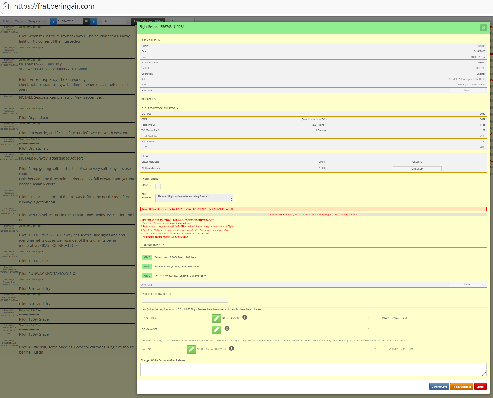
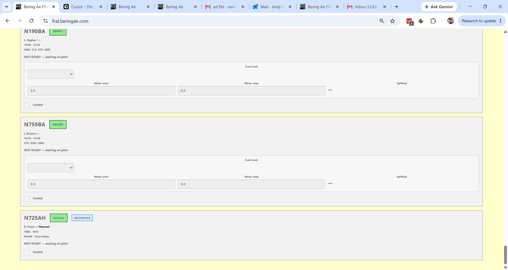
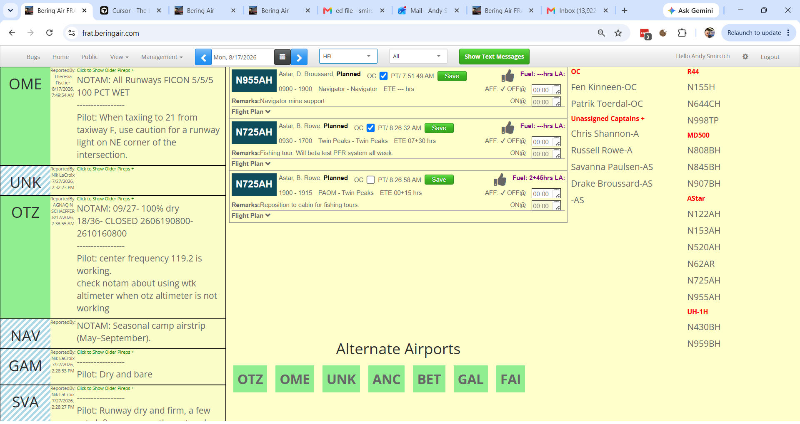

# FRA team backlog (issues)

_Generated from fraBering `/api/issues`. Regenerate: `node scripts/export-team-backlog/index.js`._

## Active (developer approved — build queue)

_Developer-approved, open or in progress. Agents should implement these._

## #19 Email reporter option

- **Type:** feature · medium · open
- **Reporter:** Bering Air

**Original report:**

Add two checkboxes near the follow up comment box for email reporter and email developer, to send an email notice of new comment instead of having to do an additional email to flag the new comment

**Progress (changed, not resolved):**

Andy Smircich: The initial reporter for a new issue, it is working correctly in the follow up comment

**Comments:**
- Andy Smircich: Additionally, when I was logged in as Bering Air, did work here, then re-logged in as Andy, comment still records that it is posted by Bering Air
- Andy Smircich: The initial reporter for a new issue, it is working correctly in the follow up comment

## #18 Helicopter pax manifest

- **Type:** bug · medium · in_progress
- **Reporter:** Benjamin Rowe

**Original report:**

Pax manifest is done on the legs page, after a flight plan is filed. Looking at my flight plan ok the status board, the pax manifest line is empty, even though I've added 3 pax and refreshed both apps with internet connectivity.

**Progress (changed, not resolved):**

Andy Smircich: -on 955ah on Monday morning flight, pax manifest does show a name in the flight plan expansion, not sure how there is a name in this but yours was empty

**Comments:**
- Bering Air: -double check import of passenger count from helicopter flight plan
- Andy Smircich: -This may be an issue with flight report.  The field called "paxManifest" imported from the pfr on the flight plan is showing a value of [] which is an empty array.  If it has any content, it should display on the release page as expected.
- Andy Smircich: -on 955ah on Monday morning flight, pax manifest does show a name in the flight plan expansion, not sure how there is a name in this but yours was empty

## Ready for review (shipped — reporter verify, do not build)

_Waiting for reporter sign-off in the app._

## #16 Update ETA

- **Type:** feature · high · ready_for_review
- **Reporter:** Benjamin Rowe
- **Status:** ready for review

**Original report:**

For all flights, we need the ability to enter an updated ETA.  If you are flying a regular schedule and experience a substantial delay, we need a way to record this info and new ETA.  

Similarly, if a flight will terminate in a village due to mechanical for example, we need a way to record completion time, location, and reason in the flight release and or takeflite or new solution.  Once again, a streamlined "one entry per user" focus to make gathering and recording this data easy and complete.

**Comments:**
- Andy Smircich: - In flight Release Modal, an updated ETA input near the bottom where other post-departure comments live
- A flight terminated away from base checkbox can reveal inputs for the other requested data points
- Data persists on flight row
- Andy Smircich: Shipped in dev — ready for your review.

Flight Release modal (bottom section, above “Changes While Enroute/After Release”):

• Updated ETA — local HH:MM; shows planned final arrival for reference
• “Flight terminated away from base” checkbox — when checked, reveals:
  - Termination location
  - Completion time (local HH:MM)
  - Reason

All fields save on the flight row (miscObject) with the existing release save — no separate save button. Disabled when flight status is Completed.

Please verify on /status: open a released/enroute flight → Flight Release → enter ETA and/or termination details → save → reopen modal and confirm values persisted.
- Andy Smircich: Small follow-up shipped in dev.

Updated ETA and “flight terminated away from base” fields are now grouped inside “Changes While Enroute / After Release (Amendments)” in Flight Release — same fields, same save on miscObject, layout aligned with #13 standby feedback.

Please confirm save/reload still works as on your prior test.

## #15 Ground Services View

- **Type:** bug · high · ready_for_review
- **Reporter:** Benjamin Rowe
- **Status:** ready for review

**Original report:**

I think we can delete the Loads Available view and simply rename the Fuel Request page "Ground Services" view.  Loads Available are already displayed on the main Flight Status board view, as well as on the Fuel Request view.  

Also, please enhance the Fuel Request/Ground Services view for optimal use on a phone.  Tail numbers should be large.  FILL TO lbs. and ADD gal. numbers should be large, clear and easy to read.  

Add a fuel truck name selector (ask Adam for Fuel truck names at bases with more than one truck) and then provide a space to enter a meter start/stop entry, which after entered will automatically calculate the actual uplifted amount for pilot review, plus will eventually help us migrate away from a paper/pencil fuel log.

**Comments:**
- Benjamin Rowe: On the Fuel Request middle section, I think a clean, complete display would be to show, for example:
FOB: 600lbs                (from previous block in)
Fill To: 1200lbs          (from pilot entered Flight Report START Fuel)
ADD: 90gal                 (calculated from 1200-600 = 600/6.7)

Currently the FOB or the word "Add" are not displayed, so ti could lead to confusion.  The above would clarify it.
- Andy Smircich: - Loads Available - A little renaming is fine, but for now I want to keep it available and separate form fueling, it is the home of the C212 andC408 load sheets online, not sure if we will get any more interest in that, but I'd like to keep it up just in case.
- We need a mobile pass on the fuel view. Details as described by reporter
- Start with AVGAS Truck,  Truck 1, and Truck 2 for both OME and OTZ, only Truck 1 in UNK.  We can change that if we need to  as we go
- Meter stop and Meter Stop entry, we had something like this before, create this before the mobile pass wo it gets included. Persist on flight row.
- Stated goal is building towards a fuel log replacement
- Andy Smircich: Shipped in dev — ready for your review.

Navbar: “Fuel Request” renamed to “Ground Services”. Loads Available view kept separate (C212/C408 load sheets).

Ground Services view (mobile-friendly card layout):

• Large tail number at top of each flight
• Fuel summary shows FOB, Fill To, and ADD clearly (e.g. FOB from block-in, Fill To from PFR start fuel, ADD = (fillTo − fob) / 6.7 gal). Twin-engine types still show per-side mains/aux where applicable.
• Fuel truck selector — OME/OTZ: AVGAS Truck, Truck 1, Truck 2; UNK: Truck 1 only
• Meter start / meter stop — uplift auto-calculated (stop − start); all persisted on flight row with truck name
• Fueled checkbox unchanged (fueler + timestamp)

Please verify on phone or narrow browser at OME/OTZ/UNK: view menu → Ground Services → confirm layout, FOB/Fill To/ADD readout, truck list, meter math, and save/reload.
- Benjamin Rowe: 6KW fuel order from yesterday looks slick!  Maybe include small the date with the aircraft? In case someone has toggled the top to a different day.
- Bering Air: -further update for formatting and readability based on latest comment
- Andy Smircich: Further update shipped in dev — ready for your review.

Per your comment — small date under each tail on Ground Services cards (fixed-wing and helicopter). Helps when someone has toggled the navbar to a different day.

Fixed-wing fuel summary unchanged from prior pass: FOB / Fill To / ADD with labels and hints (block-in, PFR start fuel, calculated ADD).

Helicopter fuel display improvements are in this build too (details on #17) — single tank gallons, FOB/ADD logic, not per-side.

Debug: left-click a Ground Services card logs the flight object to the browser console. Helicopter rows include heliSource if you need to inspect the PFR.

Please verify at OME/OTZ/UNK (and HEL for helis): toggle the date picker away from today, confirm the date under the tail matches the flight, and that FOB/Fill To/ADD still read clearly on phone or narrow browser.

## #14 Helicopter fuel request

- **Type:** feature · high · ready_for_review
- **Reporter:** Benjamin Rowe
- **Status:** ready for review

**Original report:**

Please import the helicopter fuel requests from Flight Report to the Fuel page and put in chronological order. When the flight has a departure location of Nome (Nome, PAOM, OME) the request should land on the Nome page and same logic for the OTZ and UNK pages.  If the departure location is elsewhere, no electronic fuel requests is needed in Flight Release, but the amount will show in Flight Report for pilot planning.

**Comments:**
- Andy Smircich: - Fixed wing flights enter the system through interval activity in TodaysFlights api
- Helicopter flights enter through the pilot starting a PFR in flight report, which is noted by the firebase observer
- Combine the two streams in the fuel view, make it clear which flights are helicopters to the fueler reading the view, and stack in order of estimated departure time
- Fuel request for either fixed or helicopter originates in firebase, the firebase for fixed wing is grabbed during the interval, it that helps simplify build the algorithm
- Andy Smircich: Shipped for review — helicopter PFR fuel requests merged into the Fuel view with fixed-wing flights.

**Fuel page**
- Fixed-wing and helicopter fuel requests are combined into one list, sorted by estimated departure time.
- Helicopter rows are labeled **HELICOPTER** and show aircraft type; fixed-wing layout unchanged.
- Load section remains fixed-wing only.

**Hub routing**
- **OME / OTZ / UNK** fuel views: helicopter rows appear when departure matches that hub (aliases included, e.g. PAOM/Nome, PAOT/Kotzebue, PAUN/Unalakleet, and common spelling variants).
- **HEL** fuel view: all helicopter fuel requests for the day (no departure filter).
- Departures elsewhere: no row on hub fuel pages (pilot planning still in Flight Report as before).

**Data / fueled checkbox**
- Helicopters come from Firebase (pilot-started PFR in Flight Report); fixed-wing from today’s flights + existing Firebase interval.
- Fueled checkbox for helicopters writes back to Firebase `release` (same as Flight Report behavior).

**Please verify**
1. OME fuel page: Nome-departing heli PFR appears in time order with fixed-wing flights.
2. OTZ and UNK pages: same for Kotzebue and Unalakleet departures.
3. HEL fuel page: all helis for the day visible.
4. Heli with non-hub departure: not on OME/OTZ/UNK pages.
5. Fueled checkbox on a heli row updates and persists.
6. Sort order matches departure time across fixed-wing and heli rows.
- Benjamin Rowe: Thank you for adding this.  I see a couple helicopter flights in there as NOT READY.  May be an issue with Flight Report fuel or user input.
- Bering Air: -Not ready indicates the fuel request has not been imported from the pfr on the ipad.  Can we confirm if this information has been entered properly?  If so, I can look for additional importing errors.
- Andy Smircich: Update shipped in dev — ready for your review.

Addresses NOT READY on some helicopter rows you flagged.

Root cause: helicopter fuel in Flight Report doesn’t always land in the same fields as fixed-wing (plan hours, gallons on the PFR, etc.). We were only treating legArray lbs ≥ 100 as “ready,” so valid PFRs still showed NOT READY.

Fix:
• Ground Services now marks helicopter fuel ready when Flight Report has fill-to gallons, a fuel request string, or flight-plan fuel hours
• Hub routing and time sort unchanged — OME/OTZ/UNK by departure match, HEL shows all helis for the day
• Fueled checkbox still writes back to Firebase release as before

If a row is still NOT READY: left-click the card on Ground Services and check the console — heliSource is the raw Firebase PFR. If fuel is clearly entered on the iPad and it still fails, send the PFR id from console and we’ll trace the import.

Please re-check the flights that were NOT READY on your last look.

## #13 standby flights

- **Type:** feature · high · ready_for_review
- **Reporter:** Benjamin Rowe
- **Status:** ready for review

**Original report:**

Flights with long standby time such as BRG703 8/14/26 need a method to record more detail.  
1.  In the flight info section, it is a charter, but it should say "Standby Charter" or similar.  
2.  In the amendments after release, dispatchers should note the arrival time and departure times.  For example on this flight, we need to have the UNK arrival time recorded somewhere, and the UNK departure time recorded somewhere, if we are going to keep the flight plan open on a round-robin, standby charter.

**Comments:**
- Andy Smircich: - How to identify a standby charter: Number of flight legs times 30 minutes per leg is reasonable standby time. If the ETA for the flight is more than calculated flight time (from the routing and estimated aircraft speed for type)  for the route added to this reasonable standby time, it is a standby charter.
- Internal flag that turns true when this condition is met
- Flight Info section reflects type of flight in accordance with the flag
- Notice to dispatchers help them annotate arrival and departure times for standby charters in the amendments area
- Andy Smircich: Shipped for review — standby charter detection, intermediate time fields, and dispatcher nag.

**Standby charter detection**
Charter flights are flagged as Standby Charter when either:
- Scheduled block time exceeds estimated route time + (flight legs × 30 min), using aircraft-type cruise speed for route estimate, OR
- The route has more than 5 flight legs (e.g. OME-WMO-GLV-ELI-KKA-SKK-OME).

**Flight release UI**
- Flight Info shows **Standby Charter** instead of Charter when flagged.
- After dispatch or OC release, the amendments area shows arrival/departure time fields (HH:MM, local) for each intermediate stop.
- Times are saved on the flight in `miscObject.standbyLegTimes` via the existing flight save/PATCH.

**Dispatcher nag (admin / superadmin only)**
- On today’s status board, if a standby charter is released, has an actual departure logged, and an intermediate arrival or departure is still blank 30+ minutes after the estimated time (plan times adjusted for actual vs planned first departure), a warning modal appears.
- **Open Flight Release** opens the flight to enter times; **Dismiss** hides that specific nag for the browser session.

**Please verify**
1. BRG703-style round-robin (e.g. Nome → UNK → Nome): shows Standby Charter, intermediate fields appear after release, times save and reload.
2. Long multi-leg charter (6+ legs): flags as Standby Charter even if block time is normal.
3. Short charter that does not meet either rule: still shows Charter only; no intermediate fields.
4. As admin/superadmin on a live standby flight past an overdue intermediate time: nag appears; Open Flight Release works; Dismiss does not re-nag that stop this session.
5. Non-admin users do not see the nag.
- Benjamin Rowe: I entered UNK arrival and departure times on BRG703/14th, UI seems to work good. Suggest moving the field down into the Amendments After Release section, since that is what it is.  

Since the flight was already completed, I could not test this:  If a UNK departure time is entered while the flight plan is still open (Enroute), will that update the final ETA?
- Andy Smircich: -let's try once more to get this formatted correctly
- Andy Smircich: Update shipped in dev — ready for your review.

Your formatting feedback:
• Standby charter arrival/departure times are now inside “Changes While Enroute / After Release (Amendments)” — grouped with the amendments textarea and updated ETA fields, not above the release signatures

Your ETA question — yes, for an enroute standby charter: saving an intermediate departure time (e.g. UNK) recalculates Updated ETA from the delay vs plan and saves on the flight (miscObject.updatedEta). Status board and Ground Services show updated ETA when set.

Also restored 6+ leg standby-charter detection from the original spec.

Please verify on an active enroute standby (or next BRG703-style round-robin): enter intermediate arrival/departure, save Flight Release, reopen modal and confirm times and Updated ETA persist. Board ETA should reflect updated ETA when enroute.

**Attachments:**
- 

## #17 Helicopter fuel and LA

- **Type:** bug · medium · ready_for_review
- **Reporter:** Benjamin Rowe
- **Status:** ready for review

**Original report:**

Helicopter fuel not displaying on status board. Mine displayed today but it was from the duplicate from yesterday, since when duplicating Flight Report didn't allow me to enter a fuel, also a bug i sen to Ryan. 

Load Available not displaying. 

Would like to see developers do more testing rather than relying on AI and employees for all the feedback. Many of these issue seem like no testing was done by development and lack of coordination between systems. Or was it fully tested and performed correctly?

Can not “click here and paste a screenshot” from iPad.

**Comments:**
- Andy Smircich: Approach is unchanged, just sped up.  Everything worked after the update, it was fully tested. A user has identified a problem and it will be addressed as always.  Before AI flow, many errors could not and were not caught by developers.  This includes especially all developers on staff.  Many examples available to cite.
- Andy Smircich: The only helicopter flight I see in the HEL status view departing Nome today is yours this evening, and I see that on the ground services view. Screenshot attached here. Other two flights in the system are not departing Nome, so they won't appear here.  Is there a helicopter flight you added that is not appearing on status view with HEL as base?  That code is untouched so not sure what may have changed there.  Give me a pfr number that is not appearing and I'll track it down.
- Andy Smircich: Departure for the morning flight says "Twin Peaks", added screenshot for clarity.  This won't show up on the fueler view.
- Benjamin Rowe: Looks good so far. I see 725 in thr Helicopter list and fueled myself.  For that helicopter, instead of Fill to 62gal/side, can it say Fill To 123gal?  There is only one fuel tank. It should always include the previous FOB when that is captured in Flight Report and the ADD amount also, in this case 0.
- Bering Air: -let's look into this last comment and see if we can improve the results
- Andy Smircich: Update shipped in dev — ready for your review.

Per your N725AH comment — Ground Services helicopter fuel:

• Single tank — Fill To shows total gallons (e.g. “Fill To: 123 gal”), not per-side
• FOB — from Flight Report when entered (fob / fuel on board fields), OR from the previous completed flight on that tail: last leg fuel minus burn
• ADD — Fill To minus FOB (e.g. 0 gal when FOB equals fill-to)
• If the previous PFR has no burn recorded, we do not assume full tanks — FOB shows as “missing” until burn or an explicit FOB is on the PFR. (That was the 140 gal / full-tank false read.)

Left-click the helicopter card on Ground Services to console.log the flight / heliSource for troubleshooting.

Load Available on the heli status board — not changed in this pass; still on the list separately.

Please verify N725AH or similar on Ground Services: total gallons fill-to, FOB/ADD when prior flight has burn or FR FOB entry, and “FOB: missing” when prior flight completed without burn.

**Attachments:**
- 
- 

## Needs clarification (radar — do not build)

_Waiting on reporter answers in comments._

_None._

## Out of scope for agents

- **Done** / **closed** — not listed here.
- Items without **Developer approved** — triage in `/issues` first.
