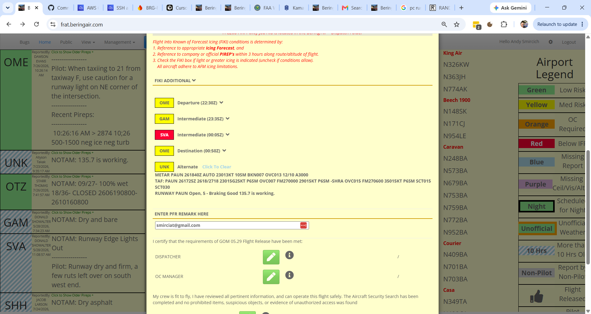
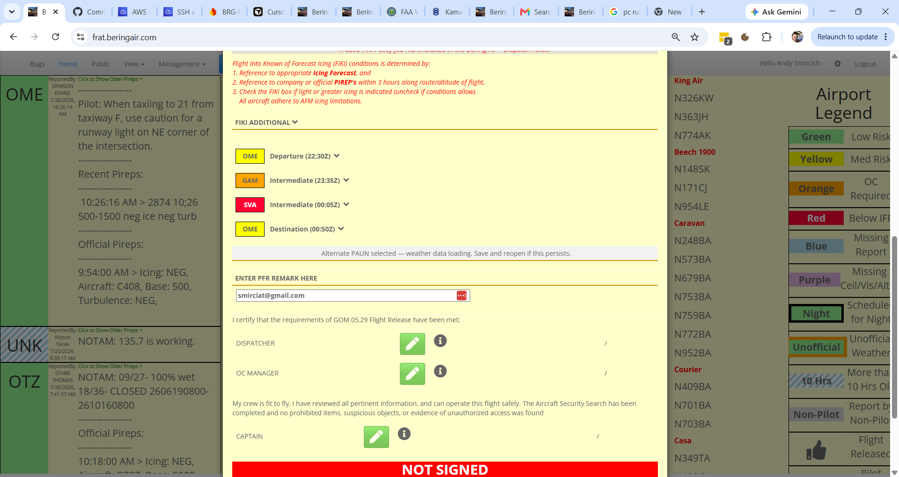

# FRA team backlog (issues)

_Generated from fraBering `/api/issues`. Regenerate: `node scripts/export-team-backlog/index.js`._

## Active (developer approved — build queue)

_Developer-approved, open or in progress. Agents should implement these._

## #5 Alternate airport on Flight Release Modal Not refreshing on screen after selection

- **Type:** bug · medium · in_progress
- **Reporter:** Bering Air

**Original report:**

On the flight release modal, select or change an alternate airport.  After selection, new alternate does not display.  After Confirm and save, reopening modal displays alternate as selected.

**Progress (changed, not resolved):**

Andy Smircich: Re-uploaded a screenshot

**Latest screenshot:**

**Comments:**
- Bering Air: Done When:
1. The process as described works correctly
2. We need to test in multiple environments, iPad is where initial problem surfaced
- Andy Smircich: New screenshot shows another failed update after select, it partially displays the alternate.  Save and reopen shows it correctly.
- Andy Smircich: New screenshot shows new detail on failed refresh after adding alternate
- Andy Smircich: Re-uploaded a screenshot

**Attachments:**
- 
- 
- 
- 

## Ready for review (shipped — reporter verify, do not build)

_Waiting for reporter sign-off in the app._

_None._

## Needs clarification (radar — do not build)

_Waiting on reporter answers in comments._

_None._

## Out of scope for agents

- **Done** / **closed** — not listed here.
- Items without **Developer approved** — triage in `/issues` first.
