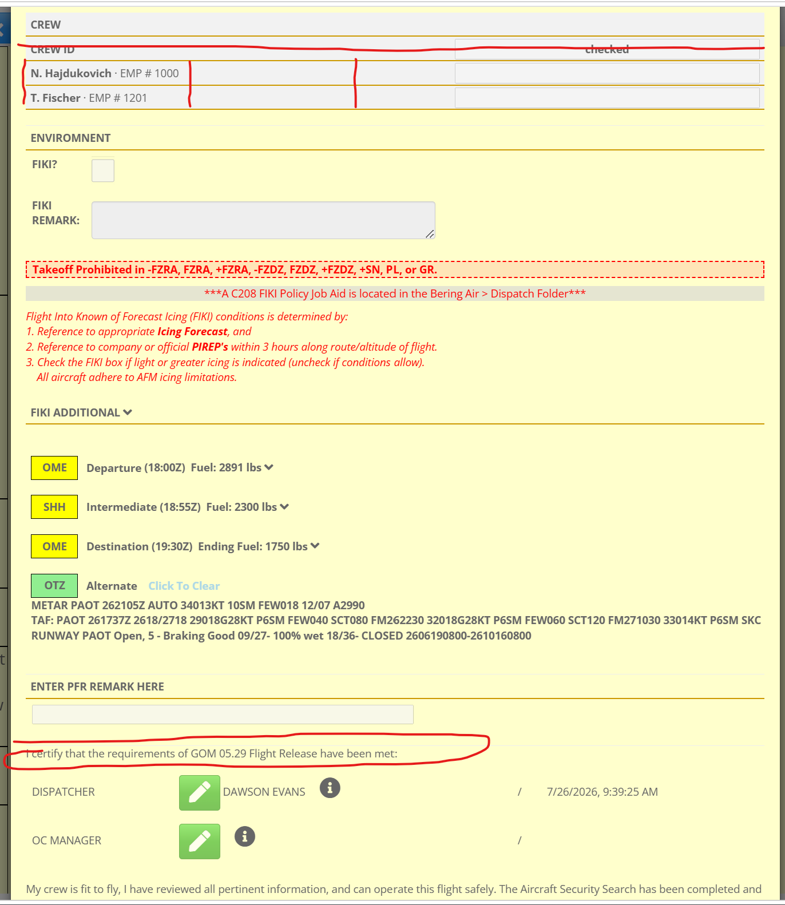
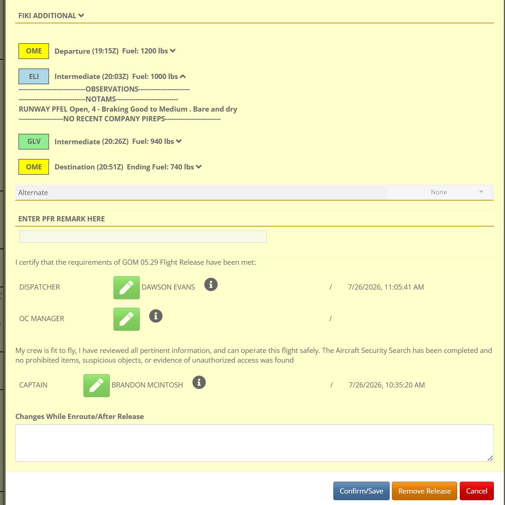

# FRA team backlog (issues)

_Generated from fraBering `/api/issues`. Regenerate: `node scripts/export-team-backlog/index.js`._

## Active (developer approved — build queue)

_Developer-approved, open or in progress. Agents should implement these._

## #8 Smircich ❤️

- **Type:** feature · high · in_progress
- **Reporter:** MATTHEW FRECKLETON

**Original report:**

Would like to make an intuitive way when we deselect FIKI box an automatic message appears “planned flight altitude below Icing forecast.”   🤓

**Progress (changed, not resolved):**

Andy Smircich: - When icing shows up in the forecast, dispatch or OC selects FIKI box for the flight requiring a closer look
- Much of the year we avoid the entire area of forecast icing by staying below the freezing level, but we have to enter a comment when removing FIKI checkbox
- A few common snippets to paste in might be helpful, Matt's suggestion is a good one, another would be "Recent PIREP indicates no icing"

**Comments:**
- Andy Smircich: - When icing shows up in the forecast, dispatch or OC selects FIKI box for the flight requiring a closer look
- Much of the year we avoid the entire area of forecast icing by staying below the freezing level, but we have to enter a comment when removing FIKI checkbox
- A few common snippets to paste in might be helpful, Matt's suggestion is a good one, another would be "Recent PIREP indicates no icing"

## #9 Seasonal Airports

- **Type:** feature · medium · in_progress
- **Reporter:** Benjamin Rowe

**Original report:**

Is it possible to seasonally add airports such as Navigator (NAV) to the sidebar list, where runway data and pireps can be updated like system airports?  It could be added now if possible and removed in November or as directed by the DO.

**Progress (changed, not resolved):**

Andy Smircich: - Lets start with Navigator and we can add to it if we need to
- airports in the side list of status view are identified in AirportRequirements by their base
- a tag like "OMESeasonal" could cause an airport like Navigator to display there with the possibility of adding NOTAMS and PIREPS like the other airports, lets say May thru September to start
- Further enhancements to this starting point are welcome

**Comments:**
- Andy Smircich: - Lets start with Navigator and we can add to it if we need to
- airports in the side list of status view are identified in AirportRequirements by their base
- a tag like "OMESeasonal" could cause an airport like Navigator to display there with the possibility of adding NOTAMS and PIREPS like the other airports, lets say May thru September to start
- Further enhancements to this starting point are welcome

## #6 Crew ID check

- **Type:** feature · medium · in_progress
- **Reporter:** Benjamin Rowe

**Original report:**

Can the crew id's line up vertically in same placeholder instead of moving left/right depending on length of person's name?  

Remove ID Checked line from CREW section.  Instead, modify the Dispatch/OC signoff statement to read "I certify that the requirements of GOM 05.29 Flight Release have been met and crew ID's checked."

**Progress (changed, not resolved):**

Andy Smircich: I need to change that comment back to what it was, sorry I missed it, thanks for the catch

**Latest screenshot:**

**Comments:**
- Andy Smircich: I understand there is now more information on checking crew IDs on the  flight release Modal.  A few changes are needed to align with Ben's expectation.  The Crew ID line above the pilot names is now a header, so the input to its right can be removed. The modeal that had been assigned to that input should be applied to the new input or inputs to the right of the pilot names just below.  The employee number detail included should be spaced over as done in table columns to keep them aligned.  The phrase "CHECKED" in the input whould display whenever pilotAgree results in truthy, and blank if falsy.
Done when:
1.  The flight release Modal appears as described
2.  This section is neat and readable and does not contain any inaccuracies or broken formatting
- Benjamin Rowe: Looks neater, thank you.  

The Dispatcher/OC signoff statement can just be "I certify that the requirements of GOM 05.29 Flight Release have been met and crew ID's have been checked."    

The Captain is the one certifying that the Captain and FO have done their respective part of the aircraft preflight and can say that the Aircraft Security Search is complete, and the Dispatcher/OC is only certifying that they checked pilot actual ID badge number against the bade number displayed from the database in Flight Report.
- Andy Smircich: That's funny, that's what the ai came up with and I thought it was wrong for some reason, I'll switch it back, thanks for the feedback on this!
- Benjamin Rowe: Can we get maybe an estimated completion date on open items added here?  This is marked as DONE.  If it was decided to leave the above suggestions not completed, can we see dialogue on it?  The Dispatcher/OC is not certifying the Aircraft Security Search, they are only certifying that they have checked ID's.  

Thanks!
- Benjamin Rowe: I just changed the status to In Progress.  I see how to do that now, my bad.
- Andy Smircich: I need to change that comment back to what it was, sorry I missed it, thanks for the catch

**Attachments:**
- 

## Ready for review (shipped — reporter verify, do not build)

_Waiting for reporter sign-off in the app._

## #7 Blue Airports

- **Type:** bug · high · ready_for_review
- **Reporter:** Benjamin Rowe
- **Status:** ready for review

**Original report:**

Blue airports - no official weather.  Flights are always released with no weather recorded.  As a pilot I would expect to look in the body of my Flight Release to find the information I need.  If I click on a blue airport, there is no AWOS official weather, no WebCam OK, no agent weather estimation.  Are we collecting an agent weather report on the phone prior to departure like used to be the case?  If so, where is that recorded?  If it's still on paper, can we get that recorded in the Flight Release instead?  I know there is an entry field for the weather but it seems to remain blank.  Maybe we need an update to that entry format?  Additonally maybe a CAVOK button?  I've added that definition to the GOM to mean weather better than 5000'/5sm.

**Comments:**
- Benjamin Rowe: For example, I like the single click on an airport in the left column to edit a runway report.  Seems like it could be on that same screen, as a dispatcher is probably going to collect an Agent weather observation at the same time as an Agent runway report.  So this form could simply have a weather section as well, with possible checkboxes for type (Webcam, Agent Obs, PIREP, AWOS va phone) and for conditions (>500/2, >1000/3, >5000/5 (CAVOK), CLEAR) and spot to enter regular details.  New reports could be entered anytime and would stack like PIREP's.  Weather reports would expire after some time, maybe 6hrs, so you can see a trend but not too much clutter.
- Andy Smircich: The rule in code is if an airport is blue, it requires OC to release, not dispatch..  This encourages dispatchers to provide some sort of observation before their sign off.  Not sure if this block is simply broken, or if it is not keeping the manual observation in the permament release record properly.  One other possibility is it was "green" when dispatch signed it but turned "blue" before pilot signed.  We need to paoosibly block pilot from blue or purple unless OC has already signed. I will investigate,
Done when:
1. Airports cannot be signed off by dispatchers when red, orange, blue, or purple.  A permament storage of color at release time is accurately kept.
- Andy Smircich: Blue airports are most often checked as webcam vfr which does not record an observation.  When Asos is available over phone but not internet, dispatchers have been filing the form in with official reported weather.  Haven't seen agent reports, but I assume its same form just unofficial, which leads to the orange border. OC input needed if we need to change any of this flow.
- Andy Smircich: #7 — Blue airports / flight release (shipped for verification)

What we fixed

Dispatch can only sign when every airport on the route is in the “routine” colors (green or yellow). If any leg is blue, purple, orange, or red, dispatch has to wait for OC to sign instead.
Captain cannot accept the release on a route with blue or purple airports until OC has signed.
When dispatch or OC signs, we freeze the weather shown in the flight release (route colors and observation text) so it doesn’t keep changing as live METAR updates. That should address releases that looked signed but had blank observations on blue airports (e.g. webcam-only checks).
Webcam VFR, webcam IFR, and phone/official manual observations entered on the airport weather form should now show up in the OBSERVATIONS section of the release when they’re current.
What to check

Route with a blue airport: dispatch sign should be blocked; OC can sign; captain blocked until OC has signed.
After webcam or manual weather on a blue airport, dispatch/OC sign → open release → expand that leg → observation text should be there.
After dispatch or OC signs, wait through a weather update cycle → locked section should not rewrite what was captured at sign-off.
Not in this change

Ben’s ideas for a richer weather block on the runway click screen (observation types, CAVOK, stacked reports with expiry) are still future work — we’d want OC/dispatch input on that workflow before building it.

If this matches what you need on blue airports for release, please verify in prod and mark ready for review / done in Issues. If something’s still off (especially empty observations after webcam), note the flight, airport, and who signed in what order.
- Benjamin Rowe: Yes, need OC/Dispatch buy in for any updates.  Purely from looking at Flight Release though, it makes it look like we are sending planes to places without knowing what the weather is.  I'm guessing they are still writing down unofficial weather they receive from an agent, a pilot, or a person at Navigator, where is that weather documented and presented to the pilot?  Verbal or on paper?  That info seems best captured in Flight Release, and a trend of it even better.  Plus a similar format and plan is there with Runway Reports and Company PIREP's.
- Andy Smircich: In Kotzebue yesterday pilots were still a little confused on this, I reassured them that the issue is most often fixed with dispatch, not OC.  The ones I talked to understand that now.

**Attachments:**
- 

## Needs clarification (radar — do not build)

_Waiting on reporter answers in comments._

_None._

## Out of scope for agents

- **Done** / **closed** — not listed here.
- Items without **Developer approved** — triage in `/issues` first.
